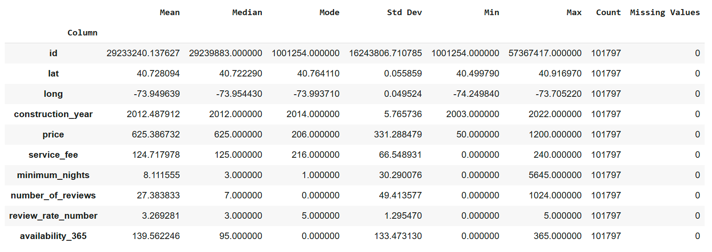
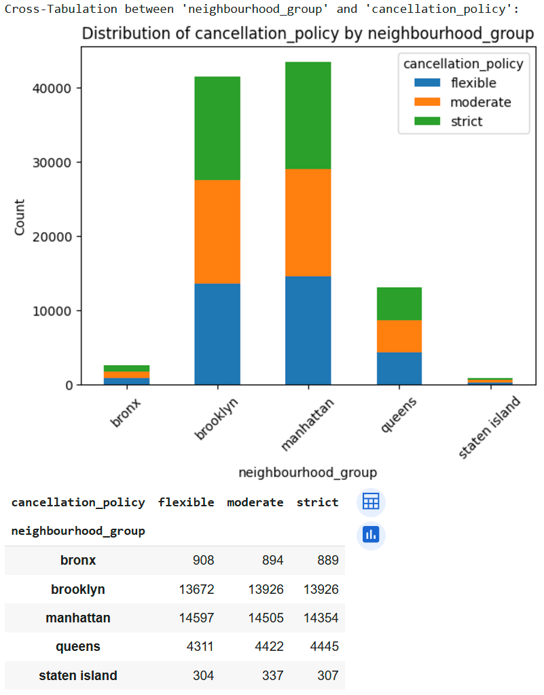

## **Project Description**

The goal of this project is to help new Airbnb hosts estimate a reasonable nightly rental price for their property based on listing characteristics. Using historical data from Airbnb listings, we build predictive models that consider factors such as location (latitude and longitude), room type, instant bookability, cancellation policy, and construction year to forecast the most suitable rental price for new listings. The analysis includes descriptive, diagnostic and predictive analytics to provide actionable insights for hosts.

## **Dataset**

The dataset used in this project is sourced from Kaggle and is publicly available at the following link:  
[Airbnb Open Data on Kaggle](https://www.kaggle.com/datasets/arianazmoudeh/airbnbopendata/dataLinks)

A detailed Data Dictionary is also provided here:  
[Data Dictionary](https://docs.google.com/spreadsheets/d/1b_dvmyhb_kAJhUmv81rAxl4KcXn0Pymz)

The dataset contains various attributes such as:

- latitude
- longitude
- room_type
- instant_bookable
- cancellation_policy
- construction_year
- price
- service_fee

<div style="page-break-after: always;"></div>

## **Required Packages and Libraries**

To run this program, you need to have the following Python packages and libraries installed:

| Library      | Version | Purpose                                                   |
| ------------ | ------- | --------------------------------------------------------- |
| pandas       | 2.0.3   | Data manipulation and analysis                            |
| NumPy        | 1.24.3  | Numerical computing with arrays and matrices              |
| matplotlib   | 3.7.2   | Creating static, interactive, and animated visualizations |
| seaborn      | 0.12.2  | Statistical data visualization                            |
| SciPy        | 1.10.1  | Mathematical algorithms and convenience functions         |
| scikit-learn | 1.3.0   | Machine learning and data mining                          |
| TensorFlow   | 2.13.0  | Building and training neural networks                     |
| NLTK         | 3.8.1   | Natural language processing                               |

## **Installation**

You can install these libraries using pip in your Google Colab environment:

```python
pip install pandas==2.0.3
pip install numpy==1.24.3
pip install matplotlib==3.7.2
pip install seaborn==0.12.2
pip install scipy==1.10.1
pip install scikit-learn==1.3.0
pip install tensorflow==2.13.0
pip install nltk==3.8.1
```

## **Usage**

1. [Download the dataset](https://www.kaggle.com/datasets/arianazmoudeh/airbnbopendata/dataLinks) and place it in the same directory as the script. Rename it as `Airbnb_Open_Data.csv`.
2. Run the script using the command:
   ```bash
   python Final_Colab_LiuLiTu.py
   ```
3. Follow the prompts to specify additional parameters (if required).

<div style="page-break-after: always;"></div>

## **Sample Output**

Running the script generates outputs such as:

- Descriptive statistics and visualizations of Airbnb listings.
- Predictive model performance metrics (e.g., R², RMSE).
- Insights into influential factors affecting rental prices.

Example:

```
# show evaluation of the models
Epoch 1/8
2545/2545 ━━━━━━━━━━━━━━━━━━━━ 8s 2ms/step - loss: 8602.8330 - mae: 21.8668
Epoch 2/8
2545/2545 ━━━━━━━━━━━━━━━━━━━━ 8s 1ms/step - loss: 638.5146 - mae: 6.3900
Epoch 3/8
2545/2545 ━━━━━━━━━━━━━━━━━━━━ 7s 2ms/step - loss: 629.4799 - mae: 7.2072
Epoch 4/8
2545/2545 ━━━━━━━━━━━━━━━━━━━━ 9s 2ms/step - loss: 598.2549 - mae: 6.2033
Epoch 5/8
2545/2545 ━━━━━━━━━━━━━━━━━━━━ 6s 2ms/step - loss: 622.5222 - mae: 6.1514
Epoch 6/8
2545/2545 ━━━━━━━━━━━━━━━━━━━━ 8s 1ms/step - loss: 674.5885 - mae: 7.0084
Epoch 7/8
2545/2545 ━━━━━━━━━━━━━━━━━━━━ 5s 2ms/step - loss: 565.2972 - mae: 5.8609
Epoch 8/8
2545/2545 ━━━━━━━━━━━━━━━━━━━━ 5s 2ms/step - loss: 579.7472 - mae: 5.5725
637/637 ━━━━━━━━━━━━━━━━━━━━ 1s 2ms/step

model	mean_squared_error	r_squared
0	Gradient Boosting Regressor	419.028167	0.996134
1	Linear Regression	1541.712942	0.985776
2	K-Nearest Neighbors Regressor	523.377052	0.995171
3	Decision Tree Regressor	973.147888	0.991022
4	Neural Network	442.572739	0.995917

```

<div style="page-break-after: always;"></div>

**Calculate Summary Statistics**



<div style="page-break-after: always;"></div>

**Explore Distribution**


<div style="page-break-after: always;"></div>

**Explore Distribution**


<div style="page-break-after: always;"></div>

**Plot Frequency Grid**


<div style="page-break-after: always;"></div>

**Group Price Analysis**


<div style="page-break-after: always;"></div>

**Group YearPrice Analysis**


<div style="page-break-after: always;"></div>

**Correlation Analysis**


